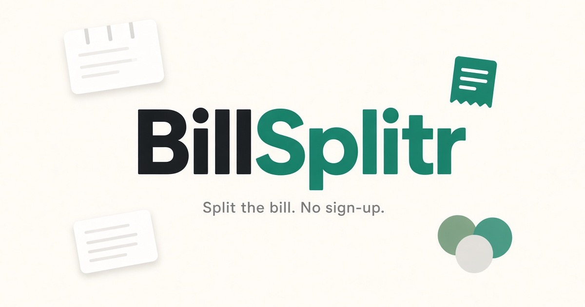

# BillSplitr

<p align="center">
  <a href="https://app.netlify.com/projects/usebillsplitr/deploys"></a>
</p>

<p align="center">
  
</p>

A clean, no-fuss way to split a bill. Add people, assign items, adjust the service/tip, and instantly see who owes what.

Live demo: https://usebillsplitr.netlify.app/

## Features

- Split bills in seconds
- Assign items to specific people
- Optional service/tip percentage
- Scan a receipt photo to fill in the items, service and currency (read by Google Gemini on its free tier)
- Short shareable links: read-only view links and edit links, always showing the latest version
- A SvelteKit single-page app styled with shadcn-svelte and Tailwind CSS, with a small Netlify backend for shared links
- Shared links expire 30 days after the last edit (a daily scheduled function deletes them)

## Run locally

```bash
npm install
npx netlify-cli dev
```

Then open http://localhost:8888. This runs the SvelteKit dev server behind Netlify, so shared links (`/<uuid>` to view, `/e/<uuid>` to edit) and their functions work too.

Receipt scanning needs a free Gemini API key from [Google AI Studio](https://aistudio.google.com/apikey), set as `GEMINI_API_KEY` in the Netlify site's environment variables (`netlify dev` uses it too). `GEMINI_MODEL` optionally overrides the model in `netlify/lib/receipt.mjs` (Flash-Lite, chosen for its speed and much larger free quota). Without a key the scan button says scanning isn't set up. When the free quota runs out, the toast says whether it's for the minute or the day, and when the daily scans come back (midnight Pacific time). On the free tier Google may use the photos to improve its models.

`npm run dev` runs the app on its own at http://localhost:5173. Without the functions, "Copy link" falls back to a compressed long link (a snapshot) and edit links aren't available.

Other scripts: `npm test` (unit tests), `npm run test:e2e` (Playwright end-to-end tests; starts `netlify dev` if it isn't running, and needs `npx playwright install chromium` once), `npm run check` (type-check) and `npm run build` (static site in `build/`).

## Project files

- `src/routes/[...path=bill]/+page.svelte` — the page; `src/params.ts` limits it to `/`, `/<uuid>` and `/e/<uuid>`
- `src/lib/components/` — the UI, one component per card; `ui/` holds the shadcn-svelte components (add more with `npx shadcn-svelte@latest add <name>`)
- `src/lib/editor.svelte.ts` — the bill's state, the current split and the editing actions
- `src/lib/share.svelte.ts` — share links, saving to the server, loading a bill and starting a new one; `storage.ts` — localStorage
- `src/lib/codec.ts` — the share format (must stay compatible with existing links), `split.ts` — the maths, `summary.ts` — the WhatsApp text, `currencies.ts`
- `src/app.html` — page head, meta tags and structured data (the home page is prerendered, so crawlers see the full page without running JavaScript); `src/app.css` — Tailwind setup and the brand theme (shadcn colour tokens for light and dark)
- `src/lib/scan.ts` — shrinks a receipt photo and sends it to the scan function; `addScanned` in `editor.svelte.ts` adds what it finds
- `netlify/functions/` — create (`POST /api/bills`), save (`PUT /api/bills/<editId>`), scan (`POST /api/scan`, with the prompt and clean-up in `netlify/lib/receipt.mjs`), the shared-bill page (`/<viewId>`, `/e/<editId>`, which embeds the bill in `build/index.html`) and the daily expiry job (`expire.mjs`)
- `netlify/lib/bills.mjs` — Netlify Blobs stores and validation shared by the functions
- `static/` — social preview image, favicons and app icons, `oembed.json`, `manifest.webmanifest`, `robots.txt` and `sitemap.xml` (update `lastmod` and the URLs if the domain changes). Shared bill pages send `X-Robots-Tag: noindex`
